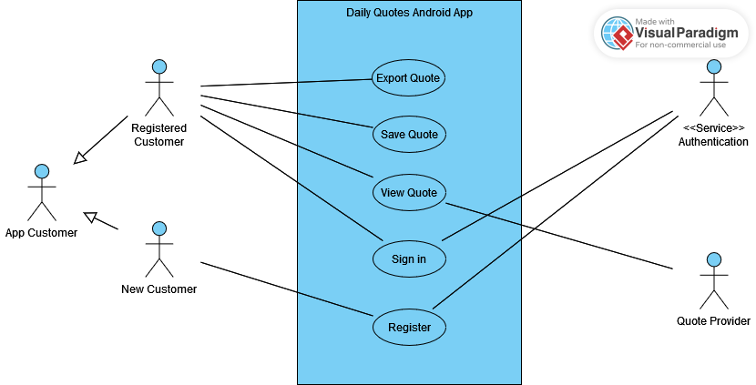

# DailyQuotes (Android) 
## Softwareanforderungen
<!--
> Bei dieser Vorlage handelt es sich um eine vereinfachte Version, die auf den Dokumentationsvorlagen von IBM Rational Unified Process (RUP) basiert.
-->

### 1. Einleitung

#### 1.1 Übersicht
<!--
> Was sind die Verkaufsargumente bzw. Alleinstellungsmerkmale Ihrer Softrware?
-->

DailyQuotes ist eine Anwednung, die dem Nutzer täglich neue Zitate liefert, die ihn motivieren und inspirieren sollen.

#### 1.2 Geltungsbereich
<!--
> Was wird in diesem Dokument behandelt (nicht behandelt)? Ist es für Ihr gesamtes System oder ein Subsystem? Deckt es sowohl funktionale als auch nichtfunktionale Anforderungen ab? (Werden Sie einige Anforderungen in ein anderes Dokument auslagern?)
-->

Dieses Dokument behandelt die Android App der Andwendung. Diese umfasst alle Funktionen, die dem Endnutzer geboten werde, kann sich in Bedienweise und Aussehen jedoch von den angepassten Versionen für andere Platformen unterscheiden.

<!--
#### 1.3 Definitionen, Akronyme und Abkürzungen
<!--
> Definitionen aller Begriffe, Akronyme und Abkürzungen, die für die ordnungsgemäße Interpretation dieses Dokuments erforderlich sind.
-->

<!--
#### 1.4 Referenzen
<!--
> Eine vollständige Liste aller referenzierten Dokumente. Jedes Dokument sollte anhand von Titel, Datum und Veröffentlichungsorganisation identifiziert werden. Sie können auch Hyperlinks einfügen, um die Referenzen bequem zu öffnen.
-->

### 2. Funktionale Anforderungen
<!--
> Dieser Abschnitt enthält alle Softwareanforderungen in einem ausreichenden Detaillierungsgrad, damit Designer ein System entwerfen können, das diese Anforderungen erfüllt, und Tester testen können, ob das System diese Anforderungen erfüllt.
> Dieser Abschnitt ist normalerweise nach Funktionen geordnet, es können jedoch auch alternative Gliederungen geeignet sein, beispielsweise die Gliederung nach Benutzer oder die Gliederung nach Subsystem.

> [HINWEIS:]
> Sie können Links zu Ihren UML-Diagrammen und User Stories oder die Bezeichnungen der User Stories in dieses Dokument einfügen.
-->

#### 2.1 Übersicht
<!--
> Eine kurze Beschreibung der Funktionalität Ihrer Anwendung.
> Fügen Sie ein oder mehrere **UML-Anwendungsfalldiagramme** und die erforderliche Beschreibung hinzu, um die wichtigsten Anwendungsfälle Ihrer Anwendung wiederzugeben.
-->

Die Anwendung soll dem Nutzer täglich ein neues Zitat bereitstellen. Der Nutzer hat die Möglichkeit, Zitate, die ihm gefallen, zu speichern oder zu exportieren.  
Daher soll der Nutzer in der lage sein, all seine gespeicherten Zitate anschauen zu können.  
Zudem soll es die Möglichkeit geben, sich jeden Tag das Zitat zu einer bestimmten Uhrzeit als [Push-Benachrichtigung](https://developer.android.com/develop/ui/views/notifications) schicken zu lassen.

Alle Daten der nutzer werden über die Geräte und Platformen synchronisiert.

#### 2.2 Nutzerregistrierung / Nutzeranmeldung

Der Nutzer hat die Möglichkeit, einen Account zu erstellen und sich mit diesem Account auf allen Platformen anzumelden.  
Auf diesem Account werden dann alle täglichen Zitate un Favoriten gespeichert und können abgerufen werden.

#### 2.3 Tägliches Zitat

Der Nutzer kriegt täglich ein neues Zitat, welches zufällig aus einer großen Sammlung von Zitaten ausgewählt wird.  
Dieses Zitat kann dann gespeichert werden, wenn es dem Nutzer gefällt.

#### 2.4 Favoriten

Der Nutzer hat bei den täglichen Zitaten die Möglichkeit, dieses als Favoriten zu markieren.  
Ein Liste aller Favoriten kann er jederzeit einsehen und bearbeiten.

#### 2.5 Exportieren von Zitaten

Der Nutzer hat die Möglichkeit, ein Zitat auf verschiedene Weisen zu exportieren:  
- Als Text exportieren
- Als Bild speichern
- In Zukunft können weitere Methoden hinzu kommen (wie z.B. zu Instagram exportieren)

<!--
#### 2.2 Name von Feature 1 / Anwendungsfall 1
> Spezifizieren Sie diese Funktion/diesen Anwendungsfall durch:
> - Relevante **User Stories**
> - **UI-Mockups**
> - **UML-Verhaltensdiagramme** und notwendige Textspezifikation
> - **Voraussetzungen**. *Eine Voraussetzung für einen Anwendungsfall ist der Zustand des Systems, der vorliegen muss, bevor ein Anwendungsfall ausgeführt wird.*
> - **Nachbedingungen**. *Eine Nachbedingung eines Anwendungsfalls ist eine Liste möglicher Zustände, in denen sich das System unmittelbar nach Abschluss eines Anwendungsfalls befinden kann.*
> - **Geschätzter Aufwand (hoch, mittel, niedrig)**

#### 2.3 Name von Feature 2 / Anwendungsfall 2
... ...
-->

### 3. Nichtfunktionale Anforderungen
<!--
> [WICHTIG:]
> Es ist nicht notwendig, alle der folgenden Kategorien abzudecken. Konzentrieren Sie sich auf das, was Sie in Ihrem Projekt umsetzten werden.
> Wenn einige nichtfunktionale Anforderungen als User Stories in Ihrem Backlog beschrieben werden, fügen Sie deren **Links** in diesem Abschnitt hinzu oder beliebige Informationen, die den Leser bei der Suche nach ihnen in Ihrem Backlog unterstützen, z.B. die **Bezeichnung** der relevanten User Story.

> Kategorien: Benutzerfreundlichkeit, Zuverlässigkeit, Leistung, Effizienz, Integrität, Wartbarkeit, Flexibilität, Testbarkeit, Wiederverwendbarkeit, Sicherheit.
-->

Eine wichtige Anforderung ist, dass der Datenverkehr mit dem Server möglichst gering gehalten wird, da dieses Projekt [Google Firebase](https://firebase.google.com/) als Backend benutzt und dort Kosten für den Traffic anfallen können.

### 4. Technische Einschränkungen
<!--
> Geben Sie alle wichtigen Einschränkungen, Annahmen oder Abhängigkeiten an, z. B. alle Einschränkungen darüber, welcher Servertyp verwendet werden soll, welche Art von Open-Source-Lizenz eingehalten werden muss usw.
-->

Der Servetyp, der der Einfachheit verwendet wird, ist [Firebase](https://firebase.google.com/). Dies ist ein Datenbankenservice von Google, der in [NoSQL](https://en.wikipedia.org/wiki/NoSQL) strukturiert ist. Die Datenbankzugriffe und -modifikationen werden vom Nutzer aus gemacht und vom Server lediglich [validiert](https://firebase.google.com/docs/firestore/security/get-started), ohne dass tatsächliche Berechnungen auf dem Server stattfinden.  