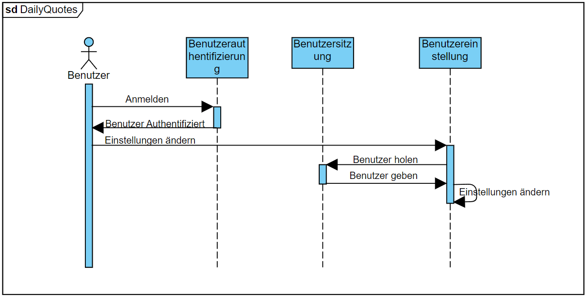

# Einführung und Ziele

## Aufgabenstellung

## Qualitätsziele
**Zuverlässigkeit:** Die Webapp soll eine sehr hohe Zuverlässigkeit und Verfügbarkeit haben. Diese Verfügbarkeit soll mindestens 99% betragen.

**Effizienz:** Tägliche und gespeicherte Zitate sollen sehr schnell (in unter 2 Sekunden) dem Nutzer angezeigt werden.

**Sicherheit:** Nutzerdaten sollen nicht verloren gehen beziehungsweise nicht von Dritten eingesehen werden können. Zudem sollen sensible Daten nicht im Klartext gespeichert werden, sondern nur mit Salt und gehasht.

**Benutzbarkeit:** Die Benutzeroberfläche soll intuitiv sein. Der Nutzer soll einfach zu den gewünschten Bereichen navigieren können. Schlussendlich soll der Nutzer ohne das Studieren einer Anleitung die Webapp sinnvoll und korrekt verwenden können.

**Wartbarkeit:** Der Code soll innerhalb von 1.30h verstanden werden können. Die Webapp soll in einzelne Komponenten unterglieder sein, sodass im Nachhinein einfach und schnell weitere Features hinzugefügt werden können.
## Stakeholder

|Rolle|Kontakt|Erwartungshaltung|
|---|---|---|
|*\<Rolle-1>*|*\<Kontakt-1>*|*\<Erwartung-1>*|
|*\<Rolle-2>*|*\<Kontakt-2>*|*\<Erwartung-2>*|

# Randbedingungen

# Kontextabgrenzung

## Fachlicher Kontext

**\<Diagramm und/oder Tabelle>**

**\<optional: Erläuterung der externen fachlichen Schnittstellen>**

## Technischer Kontext

**\<Diagramm oder Tabelle>**

**\<optional: Erläuterung der externen technischen Schnittstellen>**

**\<Mapping fachliche auf technische Schnittstellen>**

# Lösungsstrategie

# Bausteinsicht

## Whitebox Gesamtsystem

***\<Übersichtsdiagramm>***

Begründung

:   *\<Erläuternder Text>*

Enthaltene Bausteine

:   *\<Beschreibung der enthaltenen Bausteine (Blackboxen)>*

Wichtige Schnittstellen

:   *\<Beschreibung wichtiger Schnittstellen>*

### \<Name Blackbox 1>

*\<Zweck/Verantwortung>*

*\<Schnittstelle(n)>*

*\<(Optional) Qualitäts-/Leistungsmerkmale>*

*\<(Optional) Ablageort/Datei(en)>*

*\<(Optional) Erfüllte Anforderungen>*

*\<(optional) Offene Punkte/Probleme/Risiken>*

### \<Name Blackbox 2>

*\<Blackbox-Template>*

### \<Name Blackbox n>

*\<Blackbox-Template>*

### \<Name Schnittstelle 1>

...

### \<Name Schnittstelle m>

## Ebene 2

### Whitebox *\<Baustein 1>*

*\<Whitebox-Template>*

### Whitebox *\<Baustein 2>*

*\<Whitebox-Template>*

...

### Whitebox *\<Baustein m>*

*\<Whitebox-Template>*

## Ebene 3

### Whitebox \<\_Baustein x.1\_\>

*\<Whitebox-Template>*

### Whitebox \<\_Baustein x.2\_\>

*\<Whitebox-Template>*

### Whitebox \<\_Baustein y.1\_\>

*\<Whitebox-Template>*

# Laufzeitsicht

## *Nutzer*

## *Zitat*

# Verteilungssicht

## Infrastruktur Ebene 1

***\<Übersichtsdiagramm>***

Begründung

:   *\<Erläuternder Text>*

Qualitäts- und/oder Leistungsmerkmale

:   *\<Erläuternder Text>*

Zuordnung von Bausteinen zu Infrastruktur

:   *\<Beschreibung der Zuordnung>*

## Infrastruktur Ebene 2

### *\<Infrastrukturelement 1>*

*\<Diagramm + Erläuterungen>*

### *\<Infrastrukturelement 2>*

*\<Diagramm + Erläuterungen>*

...

### *\<Infrastrukturelement n>*

*\<Diagramm + Erläuterungen>*

# Querschnittliche Konzepte

## *\<Konzept 1>*

*\<Erklärung>*

## *\<Konzept 2>*

*\<Erklärung>*

...

## *\<Konzept n>*

*\<Erklärung>*

# Architekturentscheidungen
## Zuverlässigkeit - Verfügbarkeit (Z1):
**Architekturentscheidungen und Begründungen:**

• Einsatz von Cloud-basierten Services: Die Nutzung von Cloud-Diensten ermöglicht eine hohe Skalierbarkeit und Zuverlässigkeit. Cloud-Anbieter bieten in der Regel garantierte Uptime-Prozentsätze und schnell skalierbare Infrastrukturen.

**Entwurfsmuster und Begründungen:**

• Microservice-Architektur: Die Aufteilung der Anwendung in Microservices ermöglicht eine unabhängige Skalierung und Wartung einzelner Dienste, was die Verfügbarkeit des Gesamtsystems verbessert.
• Health-Check-APIs: Health-Check-APIs ermöglichen eine kontinuierliche Überwachung des Systemzustands und eine schnelle Reaktion auf Ausfälle, wodurch die Verfügbarkeit erhöht wird.

## Effizienz - Performance bei der Anzeige von Zitaten (E1):
**Architekturentscheidungen und Begründungen:**

• Optimierung der Datenbankstruktur: Eine gut strukturierte und optimierte Datenbank verbessert die Performance bei Abfragen, besonders unter hoher Last.

**Entwurfsmuster und Begründungen:**

• Data Loader: Das Vorladen von Daten minimiert die Wartezeit für den Benutzer und verbessert das allgemeine Antwortverhalten der Anwendung.

## Sicherheit - Datensicherheit (S1):
**Architekturentscheidungen und Begründungen:**

• Implementierung von TLS/SSL: Die Verwendung von Verschlüsselung für die Datenübertragung ist entscheidend, um die Datenintegrität und -sicherheit zu gewährleisten.
• Regelmäßige Sicherheitsaudits und Penetrationstests: Diese Maßnahmen sind wichtig, um Schwachstellen proaktiv zu identifizieren und zu beheben, bevor sie ausgenutzt werden können.

**Entwurfsmuster und Begründungen:**

• Secure Hash Algorithm (SHA) mit Salt für Passwörter: Diese Methode bietet eine robuste Lösung zur sicheren Speicherung von Passwörtern, wodurch die Sicherheit von Benutzerkonten erhöht wird.

## Benutzbarkeit - Bedienbarkeit (B1):
**Architekturentscheidungen und Begründungen:**
• Responsive Webdesign: Dies gewährleistet, dass die Anwendung auf verschiedenen Geräten funktioniert und eine konsistente Benutzererfahrung bietet.
• Benutzerzentriertes Design: Durch Fokus auf den Benutzer kann die Anwendung intuitiver und benutzerfreundlicher gestaltet werden.

**Entwurfsmuster und Begründungen:**

• Model-View-Controller (MVC): Die Trennung von Daten, Benutzeroberfläche und Logik verbessert die Wartbarkeit und erleichtert die Entwicklung einer benutzerfreundlichen Oberfläche.

## Wartbarkeit - Erweiterbarkeit (W1):
**Architekturentscheidungen und Begründungen:**

• Modulare Codebasis: Eine modulare Struktur erleichtert die Wartung und Erweiterung der Anwendung, da Änderungen in einem Modul weniger Auswirkungen auf andere Module haben.

• Verwendung von Design Patterns: Design Patterns bieten bewährte Lösungen für häufig auftretende Probleme, was die Wartbarkeit und Erweiterbarkeit verbessert.

**Entwurfsmuster und Begründungen:**

• Observer Pattern: Dieses Muster erlaubt eine lose Kopplung zwischen Komponenten, was die Erweiterbarkeit und Wartbarkeit der Anwendung verbessert.
# Qualitätsanforderungen

## Qualitätsbaum

## Qualitätsszenarien

- Wartbarkeit
- Effizienz
- Benutzbarkeit
- Zuverlässigkeit
- Sicherheit

die jeweiligen Beschreibungen sind [hier](asr.md) zu finden
# Risiken und technische Schulden

# Glossar

|Begriff|Definition|
|---|---|
|*\<Begriff-1>*|*\<Definition-1>*|
|*\<Begriff-2*|*\<Definition-2>*|
