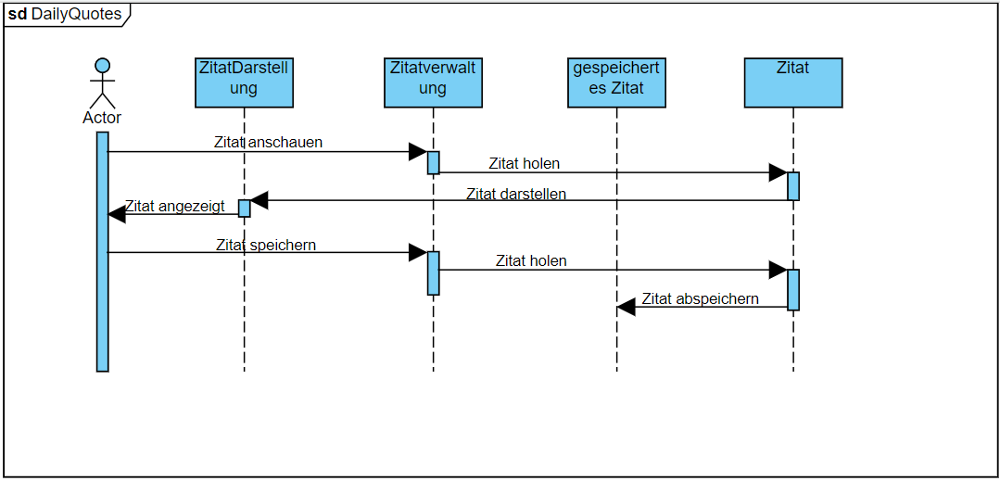

# Einführung und Ziele

## Aufgabenstellung

## Qualitätsziele

## Stakeholder

|Rolle|Kontakt|Erwartungshaltung|
|---|---|---|
|*\<Rolle-1>*|*\<Kontakt-1>*|*\<Erwartung-1>*|
|*\<Rolle-2>*|*\<Kontakt-2>*|*\<Erwartung-2>*|

# Randbedingungen

# Kontextabgrenzung

## Fachlicher Kontext

**\<Diagramm und/oder Tabelle>**

**\<optional: Erläuterung der externen fachlichen Schnittstellen>**

## Technischer Kontext

**\<Diagramm oder Tabelle>**

**\<optional: Erläuterung der externen technischen Schnittstellen>**

**\<Mapping fachliche auf technische Schnittstellen>**

# Lösungsstrategie

# Bausteinsicht

## Whitebox Gesamtsystem

***\<Übersichtsdiagramm>***

Begründung

:   *\<Erläuternder Text>*

Enthaltene Bausteine

:   *\<Beschreibung der enthaltenen Bausteine (Blackboxen)>*

Wichtige Schnittstellen

:   *\<Beschreibung wichtiger Schnittstellen>*

### \<Name Blackbox 1>

*\<Zweck/Verantwortung>*

*\<Schnittstelle(n)>*

*\<(Optional) Qualitäts-/Leistungsmerkmale>*

*\<(Optional) Ablageort/Datei(en)>*

*\<(Optional) Erfüllte Anforderungen>*

*\<(optional) Offene Punkte/Probleme/Risiken>*

### \<Name Blackbox 2>

*\<Blackbox-Template>*

### \<Name Blackbox n>

*\<Blackbox-Template>*

### \<Name Schnittstelle 1>

...

### \<Name Schnittstelle m>

## Ebene 2

### Whitebox *\<Baustein 1>*

*\<Whitebox-Template>*

### Whitebox *\<Baustein 2>*

*\<Whitebox-Template>*

...

### Whitebox *\<Baustein m>*

*\<Whitebox-Template>*

## Ebene 3

### Whitebox \<\_Baustein x.1\_\>

*\<Whitebox-Template>*

### Whitebox \<\_Baustein x.2\_\>

*\<Whitebox-Template>*

### Whitebox \<\_Baustein y.1\_\>

*\<Whitebox-Template>*

# Laufzeitsicht

## *Nutzer*

## *Zitat*

# Verteilungssicht

## Infrastruktur Ebene 1

***\<Übersichtsdiagramm>***

Begründung

:   *\<Erläuternder Text>*

Qualitäts- und/oder Leistungsmerkmale

:   *\<Erläuternder Text>*

Zuordnung von Bausteinen zu Infrastruktur

:   *\<Beschreibung der Zuordnung>*

## Infrastruktur Ebene 2

### *\<Infrastrukturelement 1>*

*\<Diagramm + Erläuterungen>*

### *\<Infrastrukturelement 2>*

*\<Diagramm + Erläuterungen>*

...

### *\<Infrastrukturelement n>*

*\<Diagramm + Erläuterungen>*

# Querschnittliche Konzepte

## *\<Konzept 1>*

*\<Erklärung>*

## *\<Konzept 2>*

*\<Erklärung>*

...

## *\<Konzept n>*

*\<Erklärung>*

# Architekturentscheidungen

# Qualitätsanforderungen

## Qualitätsbaum

## Qualitätsszenarien

- Wartbarkeit
- Effizienz
- Benutzbarkeit
- Zuverlässigkeit
- Sicherheit

die jeweiligen Beschreibungen sind [hier](asr.md) zu finden
# Risiken und technische Schulden

# Glossar

|Begriff|Definition|
|---|---|
|*\<Begriff-1>*|*\<Definition-1>*|
|*\<Begriff-2*|*\<Definition-2>*|
