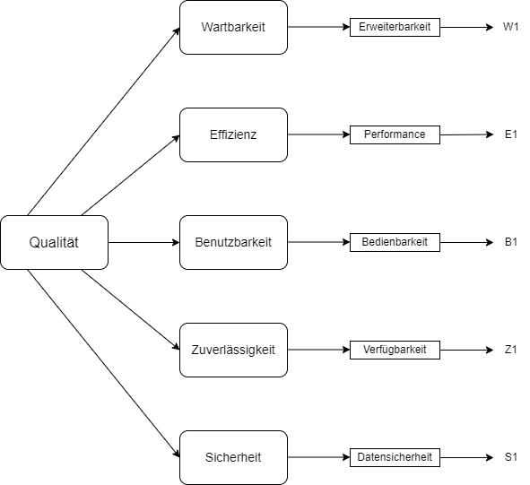

# Architecture Significant Requirements (ASR)

## Qualitätsszenarien

## Zuverlässigkeit:

**Verfügbarkeit (Z1):**

- Quelle: Benutzer bzw. möglicherweise zukünftiger Benutzer

- Auslöser: Person, welche auf die Webseite zugreifen möchte

- Artefakt: Webserver

- Umgebung: Normalbetrieb

- Antwort: Anzeige der Webseite und eines täglichen Zitats

- Antwortmaß: Verfügbarkeit von mindestens 99%

## Effizienz:

**Performance bei der Anzeige von Zitaten (E1):**

- Quelle: Benutzer bzw. möglicherweise zukünftiger Benutzer

- Auslöser: Anforderung eines Zitates

- Artefakt: Datenbank

- Umgebung: Spitzenlast

- Antwort: Schnelles Laden eines Zitates

- Antwortmaß: Antwort/ Anzeigen eines Zitates in unter zwei Sekunden

## Sicherheit:

**Datensicherheit (S1):**

- Quelle: Externe Bedrohung (Hacker, bösartige Akteure)

- Auslöser: Versuche, auf sensible Benutzerdaten zuzugreifen

- Artefakte: Datenbank und Server der Webapp

- Umgebung: Standartbetrieb

- Antwort: Die Webapp schützt effektiv vor unbefugtem Datenzugriff

- Antwortmaß: Keine erfoglreichen Sicherheitsverletzungen; Speicherung sensibler Daten als Hashes mit Salt; kein Verlust von Nutzerdaten

## Benutzbarkeit:

**Bedienbarkeit (B1):**

- Quelle: Endbenutzer

- Auslöser: Zugriff auf die Webanwendung

- Artefakt: Benutzeroberfläche der Webapp

- Umgebung: Normalbetrieb

- Antwort: Die Benutzeroberfläche ist intuitiv und einfach zu navigieren. Nutzer brauchen müssen keine Anleitungen studieren, um die Webapp sinvoll zu verwenden.

Antwortmaß: Minimale Klicks (nicht mehr als 5) erforderlich, um zu jeder bliebigen Funktion zu gelangen; positive Rückmeldungen in Benutzerumfragen zur Benutzerfreundlichkeit

## Wartbarkeit:

**Erweiterbarkeit (W1):**

- Quelle: Entwicklungsteam

- Auslöser: Notwendigkeit, Änderungen am Code vorzunehmen oder Fehler zu beheben

- Artefakt: Codebasis der Webapp

- Umgebung: Normalbetrieb/ Wartungsbetrieb

- Antwort: Der Code ist klar strukturiert, gut dokumentiert und leicht verständlich

- Antwortmaß: Verständnis des Codes innerhalb von 1.30h, sodass danach Erweiterungen eingefügt werden können; Code ist in einzelne Komponenten unterteilt, sodass Erweiterungen durch einfaches hinzufügen von neuen Komponenten schnell implementiert werden können

## Qualitätsbaum

| Qualitätsattribut | Spezifizierung | Szenarien Qualitätsattribut (wirtschaftlicher Wert, technisches Risiko) H: hoch M: medium N: niedrig |
|----------|----------|----------|
| Verfügbarkeit    | Verfügbarkeit der Webseite für Nutzer  | Anzeige der Webseite und eines täglichen Zitats; Verfügbarkeit von mindestens 99% (H, M)   |
| Performance bei der Anzeige von Zitaten    | Schnelligkeit des Ladens der Zitate  | Antwort/ Anzeigen eines Zitates in unter zwei Sekunden   |
| Datensicherheit (H, M)   | Schutz der Nutzerdaten vor Außenstehende   | Keine erfoglreichen Sicherheitsverletzungen; Speicherung sensibler Daten als Hashes mit Salt; überhaupt kein Verlust von Nutzerdaten   |
| Bedienbarkeit    | Praktikable und einfache Handhabung   | Minimale Klicks (nicht mehr als 5) erforderlich, um zu jeder bliebigen Funktion zu gelangen; positive Rückmeldungen in Benutzerumfragen zur Benutzerfreundlichkeit (H, N)  |
| Erweiterbarkeit    | Hinzufügbarkeit von neuen Features und Einstellungen  | Verständnis des Codes innerhalb von 1.30h, sodass danach Erweiterungen eingefügt werden können; Code ist in einzelne Komponenten unterteilt, sodass Erweiterungen durch einfaches hinzufügen von neuen Komponenten schnell implementiert werden können (M, M)  |

