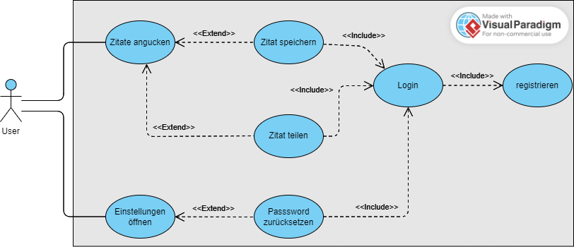

# Softwareanforderungsspezifikation (SRS) für das Projekt Daily Quotes 
**Projektname:**

Der Name unseres Projekts lautet „Daily Quotes"

**Projektvision:**

Die Daily Quotes App soll eine Plattform für tägliche Inspiration werden. Sie soll ein breites Publikum ansprechen und zu einem integrierten Teil des täglichen Lebens des Benutzers werden. Die (Web)App soll intiutiv bedienbar sein und für die Nutzer eine Quelle der Motivation sein.

**Softwareanforderungen:**

- Der User soll sich einen Account erstellen können, damit er von verschiedenen Geräten aus auf seine Daten zugreifen kann.
- Der User soll sich jeden Tag ein neues Zitat anzeigen lassen können, damit er einen erfüllteren Tag habe
- Der User soll Zitate speichern können, damit er diese auch im Nachhinein noch anschauen kann.
- Der User soll sein Passwort zurücksetzen können, damit sein Account nicht verloren geht, wenn er sein Passwort vergisst.
- Der User soll Zitate mit anderen Nutzern teilen können, damit ein Austausch stattfindet.

## 1. Einleitung

### 1.1 Übersicht
    
### 1.1.1 Verkaufsargumente

- Tägliche Motivation: Beginnen Sie jeden Tag mit einem inspirierenden Zitat, das speziell ausgewählt wird, um Ihre Motivation und Produktivität zu steigern.
- Speichern und Organisieren: Nutzer haben die Möglichkeit, ihre Lieblingszitate zu speichern und eine persönliche Sammlung von Inspirationen aufzubauen, auf die sie jederzeit zurückgreifen können.
- Teilen und Verbinden: Teilen Sie Ihre Lieblingszitate mit Freunden und Familie und schaffen Sie eine Community der Inspiration und Positivität.
- Benutzerfreundlichkeit: Eine intuitive, benutzerfreundliche Oberfläche ermöglicht ein nahtloses und angenehmes Benutzererlebnis.
- Kostenlos: Nutzen Sie alle Funktionen der Webseite kostenlos und erweitern Sie Ihren Horizont mit täglichen inspirierenden Zitaten.

### 1.1.2 Alleinstellungsmerkmale

- Handverlesene Zitate: Unsere Experten wählen täglich ein einzigartiges Zitat aus, um sicherzustellen, dass Sie mit höchster Qualität inspiriert werden.
- Personalisierte Erfahrung: Nutzer können Zitate speichern, organisieren und leicht auf sie zugreifen, was eine personalisierte Erfahrung ermöglicht.
- Soziale Integration: Mit nur einem Klick können Zitate in verschiedenen sozialen Medien geteilt werden, wodurch die Verbreitung von Positivität und Inspiration erleichtert wird.
- Zugänglichkeit: Die Webseite ist auf verschiedenen Geräten zugänglich, sodass Sie täglich, egal wo Sie sich befinden, inspiriert werden können.
- Community-Building: Die Möglichkeit, Zitate zu teilen und von anderen zu sehen, schafft eine Community von Menschen, die sich gegenseitig inspirieren und unterstützen.

### 1.2 Geltungsbereich

Das Dokument behandelt die funktionalen und nichtfunktionalen Anforderungen für die Daily Quotes Webapp und die Android-App.

### 1.3 Definitionen, Akronyme und Abkürzungen

_Bislang keine vorhanden_

### 1.4 Referenzen
- [Jira](https://daily-quotes.atlassian.net/jira/software/projects/SCRUM/boards/1/backlog)
- [Android App Repo](https://github.com/Emil-96/dailyquotes_android)

## 2. Funktionale Anforderungen

- <u>Tägliche Zitat-Anzeige:</u> Die Webapp sollte jeden Tag automatisch ein neues Zitat anzeigen.
- <u>Zitat-Speicherfunktion:</u> Nutzer sollten in der Lage sein, Zitate in ihrem persönlichen Profil zu speichern.
- <u>Teilungsfunktion:</u> Nutzer sollten Zitate über verschiedene Plattformen und Medien teilen können.
- <u>Benutzerprofil:</u> Jeder Nutzer sollte ein individuelles Profil haben, wo gespeicherte Zitate und persönliche Einstellungen gespeichert sind.
- <u>Anzeige gespeicherter Zitate:</u> Nutzer sollten in der Lage sein, eine Liste ihrer gespeicherten Zitate anzusehen.
- <u>Benutzer-Authentifizierung:</u> Ein System zur Benutzeranmeldung und -abmeldung, um die Sicherheit und Personalisierung zu gewährleisten.
- <u>Zitat-Archiv:</u> Nutzer können in einem Archiv stöbern, um frühere Zitate zu finden und anzusehen.

### 2.1 Übersicht

- Der User soll sich einen Account erstellen können, damit er von verschiedenen Geräten aus auf seine Daten zugreifen kann.
- Der User soll sich jeden Tag neue Zitate anzeigen lassen können, damit er einen erfüllteren Tag habe
- Der User soll Zitate speichern können, damit er diese auch im Nachhinein noch anschauen kann.
- Der User soll sein Passwort zurücksetzen können, damit sein Account nicht verloren geht, wenn er sein Passwort vergisst.
- Der User soll Zitate mit anderen Nutzern teilen können, damit ein Austausch stattfindet
- Der User soll Freunde hinzufügen können, damit er Zitate leichter und schneller mit diesen teilen kann
- Der User soll ein Profilbild hinzufügen können, damit seine Freunde ihn besser erkennen.

**UI-Mockup:**

### 2.2 Anzeigen des täglichen Zitats

**Relevante User-Stories:**

- Der User soll sich jeden Tag ein neues Zitat anzeigen lassen können, damit er einen erfüllteren Tag habe 

**Voraussetzung:**

- Webapp/Android-App muss starten
- Liste von Zitaten muss in Datenbank vorhanden sein
- Zitate müssen aus Liste ausgelesen werden können
- Ausgelesene Zitate müssen dem Nutzer auf dem Bildschirm angezeigt werden

**Aufwand:**

- hoch

**Nachbedingung:**

- System zeigt das aktuelle Zitat

### 2.3 Speicherung eines Zitates

**Relevante User Stories:**

- Der User soll Zitate speichern können, damit er diese auch im Nachhinein noch anschauen kann.

**Voraussetzung:**

- Punkt 2.2: Anzeigen des täglichen Zitates
- Klickbarer Button zum Speichern des Zitates
- Datenbank, die es ermöglicht Zitate und den zugehörigen User zu speichern
- Verbindung der Webapp/ Android-App mit der Datenbank

**Aufwand:**

- Mittel

**Nachbedingung:**

- Das Zitat ist im Profil des Nutzers unter den gespeicherten Zitaten vermerkt.

### 2.4 Teilen eines Zitates

**Relevante User Stories:**

- Der User soll Zitate mit anderen Nutzern teilen können, damit ein Austausch stattfindet.
   
**UI-Mockup:**

**Voraussetzung:**

- Punkt 2.2: Anzeigen des täglichen Zitates
- Klickbaren Button zum Teilen des Zitates

Aufwand:

- Hoch

Nachbedingung:

- Das ausgewählte Zitat wurde an den ausgewählten Freund versendet.

### 2.5 Erstellen eines Accounts

**Relevante User Stories:**

- Der User soll sich einen Account erstellen können, damit er von verschiedenen Geräten aus auf seine Daten zugreifen kann.

**UI-Mockup:**

**Voraussetzung:**

- Anmeldeseite
- Anmeldesystem (Firebase Authentifikation)
- Datenbank zum Speichern der Daten (Firebase Firestore)
- Verbindung zur Datenbank (Firebase Firestore)

**Aufwand:**

- Mittel

**Nachbedingung:**

- Ein neuer Account ist erstellt und die Daten des Nutzers sind in der Datenbank vorhanden.

### 2.6 Einloggen/ ausloggen Account

**Relevante User Stories:**

- Der User soll sich einen Account erstellen können, damit er von verschiedenen Geräten aus auf seine Daten zugreifen kannn. (zugehörige Funktionen zu einem Accountsystem)

**UI-Mockup:**

 

**Voraussetzung:**

- Punkt 2.5: Erstellen eines Accounts
- Einloggen: Zugriff auf Daten aus Datenbank und vergleich dieser
- Ausloggen: Klickbaren Auslog-Button

**Aufwand:**

- Gering

**Nachbedingung:**

- Der Nutzer ist im System authentifiziert und hat Zugriff auf sein Profil bzw. er kann sich ausloggen und hat dadurch keinen Zugriff mehr auf sein Profil.

### 2.7 Freunde hinzufügen/löschen

**Relevante User Stories:**

- Der User soll Freunde hinzufügen können, damit er Zitate leichter und schneller mit diesen teilen kann

**UI-Mockup:**

**Voraussetzung:**

- Punkt 2.5: Erstellen eines Accounts
- Namen, ID, etc. um Freunde zu finden und hinzuzufügen
- Anzeigen der Freunde

**Aufwand:**

- Mittel

**Nachbedingung:**

- Der ausgewählte Nutzer wurde der Freundesliste hinzugefügt/ entfernt.

### 2.8 Passwort zurücksetzen

**Relevante User Stories:**

- Der User soll sein Passwort zurücksetzen können, damit sein Account nicht verloren geht, wenn er sein Passwort vergisst.

**UI-Mockup:**

**Voraussetzung:**

- Punkt 2.5: Erstellen eines Accounts
- E-Mail-Adresse zu Benutzer in der Datenbank
- Veränderung des Passwortwertes in der Datenbank

**Aufwand:**

- Gering

**Nachbedingung:**

- Der Nutzer hat die Anweisungen zum zurücksetzen des Passwortes per E-Mail erhalten.

### 2.9 Profilbild ändern

**Relevante User Stories:**

- Der User soll ein Profilbild hinzufügen können, damit seine Freunde ihn besser erkennen.

**UI-Mockup:**

**Voraussetzung:**

- Punkt 2.5: Erstellen eines Accounts
- Anzeigen eines Bereiches für eine Profilbild
- Möglichkeit zur Bearbeitung von diesem

**Aufwand:**

- Gering

**Nachbedingung:**

- Das Profilbild des Nutzers wurde auf das von ihm ausgewählte Bild geändert.

## 3. Nichtfunktionale Anforderungen

- <u>Benutzerfreundlichkeit:</u> Die "Daily Quotes" App sollte eine intuitive und benutzerfreundliche Oberfläche bieten, die es den Benutzern ermöglicht, ohne vorherige Schulung oder das Lesen von Anleitungen auf alle Funktionen zuzugreifen. Die Navigation sollte klar und einfach sein, und die Benutzer sollten in der Lage sein, Zitate mit minimalen Interaktionen zu lesen, zu speichern und zu teilen.
- <u>Zuverlässigkeit:</u> Die Webapp und Android-App sollen funktionsfähig sein und höchstens einmal pro Monat nicht erreichbar sein (aufgrund von Bugs oder Updates)
- <u>Leistung:</u> Die "Daily Quotes" App muss in der Lage sein, eine hohe Leistung zu bieten, um ein optimales Benutzererlebnis zu gewährleisten. Dies beinhaltet die schnelle und reibungslose Anzeige von täglichen Zitaten, ohne spürbare Verzögerungen oder Latenz. Die App sollte auch unter Last, beispielsweise bei einer großen Anzahl gleichzeitiger Benutzer, effizient funktionieren.
- <u>Effizienz:</u> Die Effizienz der App ist entscheidend für die Benutzerzufriedenheit und die Ressourcennutzung. "Daily Quotes" sollte so optimiert sein, dass sie minimale Server- und Client-Ressourcen verbraucht, um eine schnelle Reaktionszeit und ein flüssiges Benutzererlebnis zu gewährleisten. Die App sollte auch in der Lage sein, Ressourcen dynamisch zuzuweisen und freizugeben, um die Effizienz zu maximieren und Ressourcenverschwendung zu minimieren.
Tägliche und gespeicherte Zitate sollen sehr schnell (in unter 2 Sekunden) dem Nutzer angezeigt werden.
- <u>Integrität:</u> Die Integrität der Daten und der Benutzerinformationen ist von höchster Bedeutung. "Daily Quotes" muss sicherstellen, dass die Zitate und Benutzerdaten zu jeder Zeit genau, konsistent und sicher sind. Dies beinhaltet den Schutz vor unbefugtem Zugriff, Datenverlust und -korruption. Mechanismen zur Datensicherung und -wiederherstellung sollten implementiert sein, um die Integrität der Daten auch im Falle eines Systemausfalls oder Sicherheitsvorfalls zu gewährleisten.
- <u>Wartbarkeit:</u> Die Wartbarkeit der "Daily Quotes" App ist entscheidend für ihre langfristige Zuverlässigkeit und Effizienz. Der Code sollte klar, gut dokumentiert und modular sein, um die Wartung zu erleichtern. Updates, Fehlerbehebungen und Verbesserungen sollten einfach implementiert werden können, ohne die vorhandene Funktionalität oder das Benutzererlebnis zu beeinträchtigen.
Der Code soll innerhalb von 1.30h verstanden werden können. Die Webapp soll in einzelne Komponenten unterglieder sein, sodass im Nachhinein einfach und schnell weitere Features hinzugefügt werden können.
- <u>Erweiterbarkeit:</u> Die App sollte so konzipiert sein, dass sie leicht erweitert und skaliert werden kann, um neue Funktionen und Kapazitäten hinzuzufügen. Dies erfordert eine flexible Architektur und die Fähigkeit, neue Module oder Komponenten nahtlos zu integrieren, ohne die bestehende Struktur und Funktionalität zu stören.
- <u>Sicherheit:</u> Die Nutzerdaten wie z.B. die E-Mail Adresse sollen sicher sein und nicht von außenstehenden Personen einsehbar sein. Nutzerdaten sollen nicht verloren gehen beziehungsweise nicht von Dritten eingesehen werden können. Zudem sollen sensible Daten nicht im Klartext gespeichert werden, sondern nur mit Salt und gehasht.
- <u>Zuverlässigkeit:</u> Die Webapp soll eine sehr hohe Zuverlässigkeit und Verfügbarkeit haben. Diese Verfügbarkeit soll mindestens 99% betragen.

_Bemerkung: User-Stories beschreiben bei uns eher die funktionalen Anforderungen_

## 4. Technische Einschränkungen

Der Servetyp, der der Einfachheit verwendet wird, ist [Firebase](https://firebase.google.com/). Dies ist ein Datenbankenservice von Google, der in [NoSQL](https://en.wikipedia.org/wiki/NoSQL) strukturiert ist. Die Datenbankzugriffe und -modifikationen werden vom Nutzer aus gemacht und vom Server lediglich [validiert](https://firebase.google.com/docs/firestore/security/get-started), ohne dass tatsächliche Berechnungen auf dem Server stattfinden.

## 5. Aktivitätsdiagramme

## 6. Sequenzdiagramme

