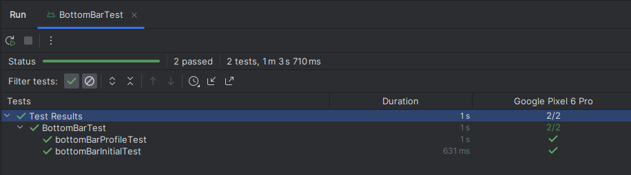

# Testbericht für die Android App

Da wir eine ziemlich einfach Infrastruktur haben, gab es nicht viel zu testen. Daher haben wir uns dafür entscheiden, UI Komponente zu testen.

## Testumgebung (Teststrategie)

Die Android App wurde in Android Studio geschrieben und zur Entwicklung der UI wurde Jetpack Compose verwendet.

Jetpack Compose hat eine eigene Testbibliothek, die auch in Android Studio integriert wurde. Dies haben wir uns zunutze gemacht.

## Was testen wir (Testplan)

Wie oben schon beschrieben, haben wir eine sehr einfache Infrastruktur, weshalb es nicht viel zu testen gab. Daher haben wir uns dafür entscheiden, UI Komponente zu testen.

Beispielsweise testen wir die *Bottom Bar*.  
Diese sieht so aus:


Dabei testen wir, ob die Auswahl auch richtig stattfindet, je nachdem auf welcher Seite man aktuell ist.  
Dazu verwenden wir die Test-Suite von Android Studio.

## Die Tests schreiben (Testfälle)

In Android Studio erstellen wir nun die Tests in eine Datei. Dort werden die Tests als Funktionen mit einem `@Test` als Funktionen geschrieben.
Nun sind sie ausführbar.

Wir wollen die *Bottom Bar* testen. Daher schreiben wir eine Funktion, die dieses UI Element erstellt und schaut, nach dem Aufrufen das erste Item ausgewählt ist.

```kotlin
@OptIn(ExperimentalFoundationApi::class)
@Test
fun bottomBarInitialTest() {
	composeTestRule.setContent {
		val scope = rememberCoroutineScope()
		val pagerState = rememberPagerState(pageCount = { 2 })

		BottomBar(
			pagerState = pagerState,
			setPosition = {
				scope.launch {
					pagerState.animateScrollToPage(it)
				}
			},
			navigationItems = getNavItems(),
		)
	}

	composeTestRule
		.onNodeWithText(BottomNavigationItem.HomeScreenItem.label)
		.assertIsSelected()

	composeTestRule
		.onNodeWithText(BottomNavigationItem.ProfileScreenItem.label)
		.assertIsNotSelected()
}
```

Dies ist der erste Test.

Wenn wir nun auch testen wollen, ob wenn wir auf der zweiten Seite sind, auch das zweite Icon ausgewählt ist, dann ändern wir den Code wie folgt:

Wir erstellen `pagerState` so, dass wir auf Seite 1 sind.
```kotlin
val pagerState = rememberPagerState(
	initialPage = 1,
	pageCount = { 2 }
)
```

Die beiden Testregeln drehen wir nun um, sodass wir schauen, ob die Auswahl andersherum ist.
```kotlin
composeTestRule
	.onNodeWithText(BottomNavigationItem.HomeScreenItem.label)
	.assertIsSelected()

composeTestRule
	.onNodeWithText(BottomNavigationItem.ProfileScreenItem.label)
	.assertIsNotSelected()
```

## Durchführung der Tests (Testergebnisse)

Die Tests laufen auf entweder lokal auf einem Emulator oder auf einem Gerät. Dabei ist auf dem Gerät nichts zu sehen, jedoch wird der Code im Huntergrund ausgeführt.

Um die Tests durchzuführen, muss man lediglich in Android Studio die Datei offen haben, in der diese Tests liegen und dann oben auf den grünen *play* Pfeil drücken.

Nun öffnet sich die Testübersicht, wo man sehen kann, ob diese Tests erfolgreich waren oder ob sie fehlgeschlagen sind, zusätzlich zu diversen Informationen wie unter anderem die Laufzeit.

Die Testübersicht sieht so aus:



Hier sehen wir, dass die beiden geschriebenen Tests erfolgreich abgeschlossen wurden.

Zur Zeit des Testens gab es keine uns bekannten Fehler in unserem Projekt und das Testen hat aich keine Fehler aufgedeckt.

## Metriken

Hier sind die wichtigsten Metriken im Überblick:

#### Gefundene Fehler

Wir haben durch die Tests keine Fehler ausfindig machen können.

#### Zeit für die Fehlerbehebung

Da wir keine Fehler gefunden haben, mussten auch keine behoben werden.

#### Erreichte Testabdeckung

DIe erreiche Testabdeckung ist ziemlich gering, da das schreiben von UI Elementen mit Hilfe von Jetpack Compose ziemlich intuitiv ist und die Tests selten aussagekräftig waren. Ein fehlgeschlagener Test lag immer an einem Fehler in der Konstruktion des Testes, nicht an einem Fehler im Code. Um weitere Irritationen zu vermeiden, haben wir darauf verzichtet, eine große Testabdeckung anzustreben.

## Empfehlungen

Da unser Code nicht wirklich testbar ist, lassen sich schwer Empfehlungen und Schlussfolgerungen aus diesen Tests schließen. Wir werden die Möglichkeit des Testens in unser Repertoire aufnehmen und verwenden, sollten wir auf ein komplexes Problem stoßen.  
Da unser Code aber simpel und schwierig zu testen ist, zusätzlich das Schreiben von Tests deutlich mehr Arbeit ist, als der daraus entstandne Nutzen rechtfertigt, werden wir weiterhin das Meiste per Hand überprüfen und nur bei äußerst komplexen Konstruktionen automatisiert testen.

## Schlussfolgerungen

Durch die Anwendung von Tests haben wir uns mit der Materie des Testens beschäftigt und uns eine Möglichkeit für die Zukunft gegeben, komplexe Probleme zu lokalisieren.
